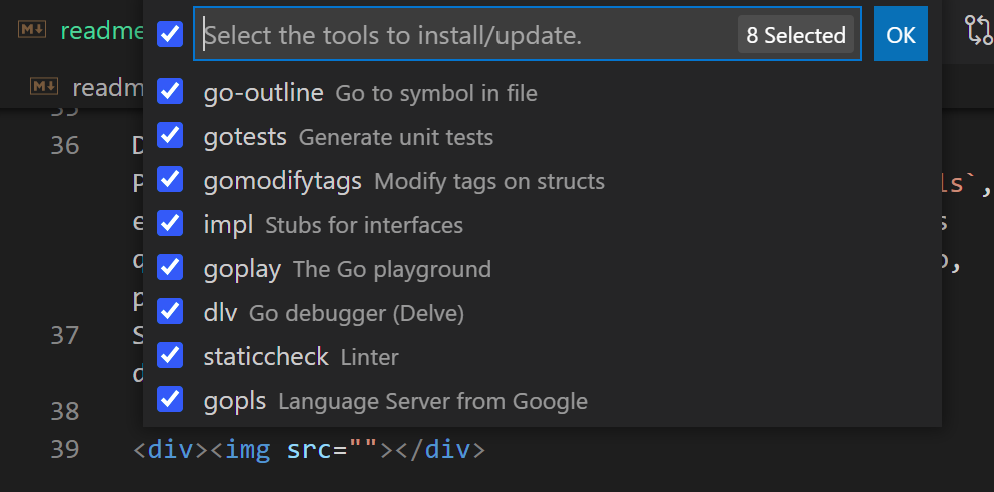

# GO 


Docker 	


Los detalles más importantes a conocer sobre este lenguaje es que fue creado por Google, se destaca por ser un lenguaje compilador y la similitud que llega a tener con C, además tiene un tipado estático y posee su propio Garbaje Collector.

Fue diseñado especificamente para el internet y la concurrencia, es decir, el manejo de miles o millones de conexiones simultaneas. 

Tiene una compilación muy rápida y eficiencia similar a C.

Está pensado como un lenguaje de servidores o bajo comandos, también, pensado para procesos y automatización. Por otro lado es una excelente opción para el manejo de APIs y Sockets (Puertos dedicados para una función de alta demanda).

Por ejemplo algunas empresas que hacen uso de Go son:
* Docker
* Dropbox
* Uber
* Netflix
* Mercado libre

Contenido basado en los ejercicios del siguiente repositorio: [Presiona aquí](https://github.com/siddharta1337/Aprende-Go.git)

## Descarga GO

Para obtener GO puedes ir a la pagina oficial y descargarlo, o bien [Presiona Aquí](https://go.dev/dl/) para ser dirigido en automático a la sección de descargas oficial. (Es recomendable descargar la ultima versión estable).

Para verificar que todo se encuentra correctamente use los siguientes comandos:

```
go version //Devolverá la versión actual
go env //Permitirá ver las variables de entorno
```

Los valores más importantes a buscar son `GOROOT` y `GOPATH` si todo se encontró bien entonces podemos seguir avanzando.

## Configuración de GO
Para ello usaremos Visual Studio Code y la extensión llamada **Go** y puedes obtenerla del siguiente enlace: [enlace](https://marketplace.visualstudio.com/items?itemName=golang.Go)

Despues de ello debemos dirigirnos a View-->Command Pallete y ponemos el comando `go: install update tools`, esto nos dará la posibilidad de instalar herramientas que nos permitan mejorar la experiencia de desarrollo, por ejemplo: opciones de autocompletado, etc.
Se recomienda seleccionar todas las opciones que se despliegan y presionando **OK**.

<div></div>

Ahora sólo espera a que terminen de actualizarse las dependencias, cuando acaben verás un mensaje como el siguiente:

<div></div>

Para comenzar podemos crear la siguiente estructura:

<div></div>

Con estas configuraciones le daremos soporte de autocompletado y más acciones referentes al lenguaje GO.
